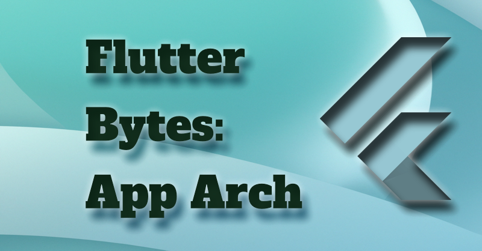

# Flutter Bytes: App Arch

A different approach to teaching flutter in that I am creating real apps to teach flutter and dart.

The apps in this repo are:
         Todo
         Starwars

And they show all the architecture, data-binding, and levels of asynchronous programming that can be used.

## Screen Shots

ToDoApp

StarWarsApp

## Social

The free medium-friend link to my medium articles:

[My Medium Blog](https://fredgrott.medium.com)

appear on these social sites:

[Facebook Flutter Community Group](https://www.facebook.com/groups/fluttercommunity/)

[Flutter Discord](https://discord.com/invite/N7Yshp4)

{Flutter Community Slack](https://fluttercommunity.dev/joinslack)

[Instagram](https://www.instagram.com/fredgrott/)

[Linkedin](https://www.linkedin.com/in/fredgrottstartupfluttermobileappdesigner/)

[Twitter](https://twitter.com/fredgrott)

[Flutter Community at Twitter Communities](https://twitter.com/i/communities/1472249315724771329)

## License

BSD-clause 3 license copyright 2023 by Fredriok Allan Grott

